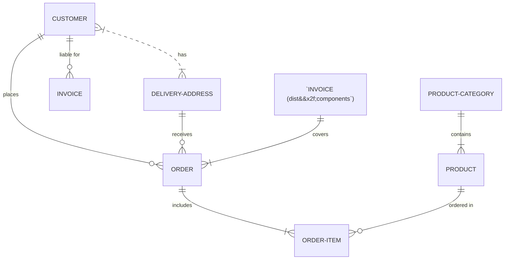

This code snippet is configuring TypeScript to include all Vue files in the `src/components` directory and its subdirectories, while excluding the `vite.config.ts` file.
<!-- NOTE-swimm-snippet: the lines below link your snippet to Swimm -->
### 📄 vite.config.ts
```typescript
14           typescript({
15             exclude: ['vite.config.ts'],
16           }),
```

<br/>

<!--MERMAID {width:100}-->

<!--MCONTENT {content: "erDiagram<br/>\nCUSTOMER }|..|{ DELIVERY-ADDRESS : has<br/>\nCUSTOMER ||--o{ ORDER : places<br/>\nCUSTOMER ||--o{ INVOICE : \"liable for\"<br/>\nDELIVERY-ADDRESS ||--o{ ORDER : receives<br/>\n\"`INVOICE (dist&amp;#x2f;components`)\" ||--|{ ORDER : covers<br/>\nORDER ||--|{ ORDER-ITEM : includes<br/>\nPRODUCT-CATEGORY ||--|{ PRODUCT : contains<br/>\nPRODUCT ||--o{ ORDER-ITEM : \"ordered in\""} --->

<br/>

This file was generated by Swimm. [Click here to view it in the app](https://swimm-web-app.web.app/repos/Z2l0aHViJTNBJTNBdGVzdC1kb2NzLXJlcG8lM0ElM0FSeWFuSGF2b2M=/docs/otpiriee).
