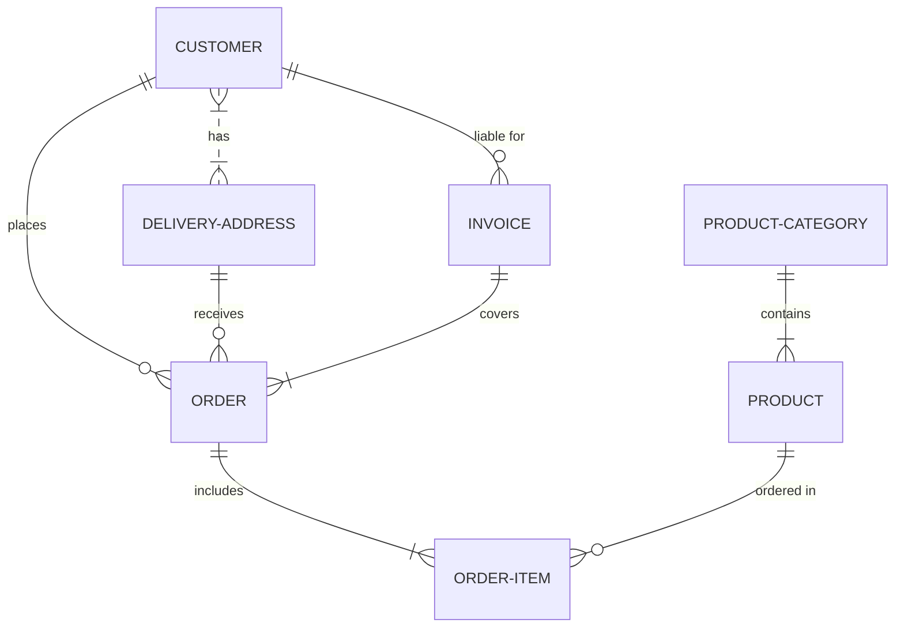

Testing [My first doc](my-first-doc.rcpng68b.sw.md) testing

 

<!--MERMAID {width:50}-->

<!--MCONTENT {content: "erDiagram \nCUSTOMER }|..|{ DELIVERY-ADDRESS : has \nCUSTOMER ||--o{ ORDER : places \nCUSTOMER ||--o{ INVOICE : \"liable for\" \nDELIVERY-ADDRESS ||--o{ ORDER : receives \nINVOICE ||--|{ ORDER : covers \nORDER ||--|{ ORDER-ITEM : includes \nPRODUCT-CATEGORY ||--|{ PRODUCT : contains \nPRODUCT ||--o{ ORDER-ITEM : \"ordered in\" "} --->

 

This file was generated by Swimm. [Click here to view it in the app](http://localhost:5000/repos/Z2l0aHViJTNBJTNBdGVzdC1kb2NzLXJlcG8lM0ElM0FSeWFuSGF2b2M=/docs/gk48l51l).
